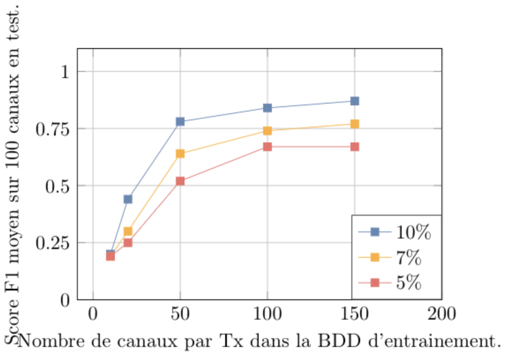

# Diversification des Données pour l’Identification d’Empreinte RF

## Introduction - Présentation 
L'objectif de ce git est de reproduire une partie des résultats présentés dans l'article "Diversification des Données pour l’Identification d’Empreinte RF" soumis au GRETSI 2025. 

Le script Fig1.jl permet de reproduire la Figure 1 de l'article, et le script Fig3.jl permet d'obtenir une partie des résultats du tableau 3 et génère le tableau 4.

## Reproduire la Figure 1
La Figure 1 est obtenue à partir de données virtuelles générées par l'outil RiFyFi. Cet outil génère des bases de données (BDD) virtuelles de signaux RF (OFDM ici) sous forme d'échantillon IQ (complexe) avec des imperfections RF. L'ajout d'imperfection est basé sur des modélisations d'imperfection de la littérature. Les BDD créées sont composées de 5 émetteurs (paramètres des imperfections différents pour chaque émetteur) et le pourcentage (5\%, 7\%, 10\%) indique la similarité des imperfections. Plus le pourcentage est faible plus les émetteurs ont des imperfections similaires.

Chaque point de la courbe de la Figure 1 correspond à un entrainement d'un réseau AlexNet avec une BDD. Chaque BDD a une plus ou moins forte similarité entre les émetteurs (couleur de la courbe) et un plus ou moins grand nombre de réalisations de canaux de propagation (en abscisse). La Figure 1 présente le score F1 obtenu en ordonné en phase de test avec d'autres réalisations de canaux de propagation que celles utilisées en entrainement. L'objectif étant d'avoir un score F1 le plus proche de 1.

Dans le dossier Configurations des fichiers définissent les paramétrages des empreintes RF (défaut RF) des différents émetteurs pour les différentes configurations possibles (5\%, 7\% et 10\%)

Pour obtenir la Figure 1, vous devrez :
- Disposer de Julia 1.8 
- Cloner ce projet git dans votre espace de travail. 
- Se déplacer dans le dossier "Diversification ..." qui a été créé, et lancer Julia 
```
cd Diversification... 
Julia 
```
- Activer le package 
```pkg
pkg> activate .
```
- Lancer la commande dans un terminal Julia 
```
julia> include("Fig1.jl")
```

Ensuite vous n'aurez plus qu'à attendre (assurez-vous d'avoir un GPU pour permettre de réduire le temps d'exécution qui est déjà assez long sur GPU. Pour un GPU H100 il faut compter environ 125h pour générer la Figure 1.)

Après l'exécution, le script LaTeX de la Figure 1 se trouvera dans le dossier "run" créé automatiquement à la racine du dossier "Diversification...". Vous retrouverez également dans le dossier run les différents réseaux de neurones entraînés ainsi qu'un fichier comprenant les scores F1 sur la BDD d'entraînement et de test au cours de l'apprentissage (donc en fonction du temps).

La Figure obtenue devrait ressembler à celle-ci, quelques variations de valeurs peuvent apparaitre.
Résultats dans le papier :
<div align="center">
  
</div>


## Reproduire une partie de la Table 3 et Table 4

Pour la Table 3, on propose de reproduire seulement une partie. 
Celle-ci a été générée à partir de données réelles enregistrées dans notre Labo. Ces données doivent être téléchargées grâce au script Load_CSV_File.sh à lancer grâce à la commande : 
```
bash Load_CSV_File.sh 
```
À la racine du dossier "Diversification...". Ce script crée l'arborescence des dossiers avec les fichiers CSV qui contiennent les données pour l'entraînement et le test.

Les dossiers intitulés Run1 servent à l'entraînement et au test, et les dossiers Run5 servent seulement en test.
Dans ces dossiers, il y a plusieurs fichiers, des fichiers intitulés BigLabels contiennent les labels des transmetteurs, les fichiers BigMat contiennent les séquences émises. Pour chaque intitulé on retrouve l'ensemble d'entrainement et de test. On trouve également l'information Préambule ou Payload dans le nom des fichiers permettant de savoir de quel mode il s'agit. 


Ici nous proposons d'entraîner le réseau avec le mode préambule avec 2 tailles de bases de données : 9000 signaux par transmetteur et 45000 signaux par transmetteur, et de tester ces performances grâce au scénario 1 (le même qu'en entraînement) et le scénario 4 (ici run 5).
Ce qui correspond aux cases en rouges pour le scénario 1 et aux cases en bleu pour le scénario 4, sur la figure correspondant au papier ci-dessous. Ces résultats seront fournis sous forme d'un tableau de type DataFrame présenté ci-après.

Résultats dans le papier :
<div align="center">
  
</div>

Forme obtenue ici :
<div align="center">
  
</div> 


La même chose est proposée pour le mode Payload avec 9000 et 180000 signaux par émetteurs.

<div align="center">
  
</div>

Forme obtenue ici :
<div align="center">
  
</div> 

En supposant que vous ayez généré la Figure 1 avant les autres, vous devrez vous assurer d'avoir bien téléchargé les BDD réelles grâce au script Load_CSV_File.sh et les enregistrer à la racine du dossier "Diversification...". ensuite, vous pouvez lancer la commande dans un terminal Julia
```
julia> include("Fig3.jl")
```
Pour un GPU H100 l'execution prend environ 1h.
À la fin de l'exécution les deux tables correspondant à une partie de la table 3 seront affichées dans l'invite de commande et le script latex de la table 4 sera disponible dans Results/Exp/No_channel_5_256_AlexNet_Payload/RunTrain1_RunTest5_Test1_nothing/ 
La table présentée dans l'article est celle correspondant à 200000 signaux (180000+20000).


