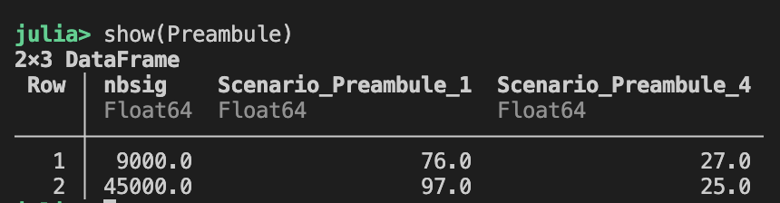

# Diversification des Données pour l’Identification d’Empreinte RF

## Introduction - Présentation 
L'objectif de ce git est de reproduire une partie des resultats présentés dans l'article "Diversification des Données pour l’Identification d’Empreinte RF" soumis au GRETSI 2025. 

Le script Pluto Fig1.jl permet de reproduire la Figure 1 de l'article, et le script Fig3.jl permet d'obtenir une partie des résultats du tableau 3 et génère le tableau 4.

## Reproduire la Figure 1
La Figure 1 est obtenue à partir de données virtuelles générées par l'outil RiFyFi. Cet outil génère des bases de données (BDD) virtuelles de signaux RF (OFDM ici) sous forme d'échantillon IQ (complexe) avec des imperfections RF. L'ajout d'imperfection est basé sur des modélisations d'imperfection de la litérature. Les BDD crées sont composées de 5 emetteurs (parametrage des imperfections différents pour chaque emetteur) et le pourcentage (5\%, 7\%, 10\%) indique la similarité des imperfections. Plus le pourcentage est faible plus les emetteurs ont des imperfections similaires.

Chaque point de la courbe de la Figure 1 correspond à un entrainement d'un réseau AlexNet avec une BDD. Chaque BDD a une plus ou moins forte similartité entre les émetteurs (couleur de la courbe) et un plus ou moins grand nombre de réalisation de cannaux de propagation (en abscisse). La Figure 1 présente le score F1 obtenu en ordonné en phase de test avec d'autres réalisations de cannaux de propagation que celles utilisées en entrainement. L'objectif étant d'avoir un score F1 le plus proche de 1.

Dans le dossier Configurations des fichiers définissent les paramétrages des empreintes RF (défaut RF) des différents emetteurs pour les différentes configuration possible (5\%, 7\% et 10\%)

Pour obtenir la Figure 1, vous devrez :
- Disposer de Julia 1.8 
- Cloner ce projet git dans votre espace de travail. 
- Se déplacer dans le Dossier "Diversification ..." qui a été créé, et lancer julia 
```cd Diversification... 
julia 
```
- Activer le package 
```pkg
pkg> activate .
```
- Lancer la commande dans un terminal julia 
```
julia> include("Fig1.jl")
```

Ensuite vous n''aurez plus qu'a attendre (assurez-vous d'avoir un GPU pour permettre de réduire le temps d'execution qui est déjà assez long sur GPU plusieurs dizaines d'heure.)
Après l'éxécution, le script Latex de la Figure 1 se trouvera dans le dossier "run" créé automatiquement à la racine du dossier "Diversification...". Vous retrouverez également dans le dossier run les différent réseaux de neurones entrainés ainsi qu'un fichier comprenant les scores F1 sur la BDD d'entrainement et de Test au cours de l'apprentissage (donc en fonction du temps).

## Reproduire une partie de la Table 3 et Table 4

Pour la Table 3, on propose de reproduire seulement une partie. 
Celle-ci a été générée à partir de données réelles enregistré dans nos Labo. Ces données doivent être téléchargées ICI et mise à la racine du dossier "Diversification...", en conservant la hierachisation des dossiers.

Les dossiers intitulés Run1 servent à l'entrainement et au test et les dossiers Run5 servent seulement en test.
Dans ces dossiers il a plusieurs fichiers, des fichiers intulés bigLabels contiennent les labels des transmetteurs, les fichier bigMat contiennent les sequences emises. Pour chaque intitulé on retrouve l'ensemble d'entrainement et de test. On trouve également l'information Preamble ou Payload dans le nom des fichiers permettant de savoir de quel mode il s'agit. 

Ici nous proposons d'entrainer le réseau avec le mode préambule avec 2 tailles de bases de données 9000 signaux par transmetteurs et 45000 signaux par transmetteur et de tester ces performance grace au scenario 1 (le même qu'en entrainement) et le scenario 4 (ici run 5). Ce qui correspond aux case en rouges pour le scenario 1 et aux case en bleu pour le scenario 4. Ces resultats seront fournit sous forme d'un tableau de type DataFrame.


Sous la forme : 


<div align="center">
  
</div>

La même chose est proposé pour le mode Payload avec 9000 et 145000 signaux par emetteurs.


